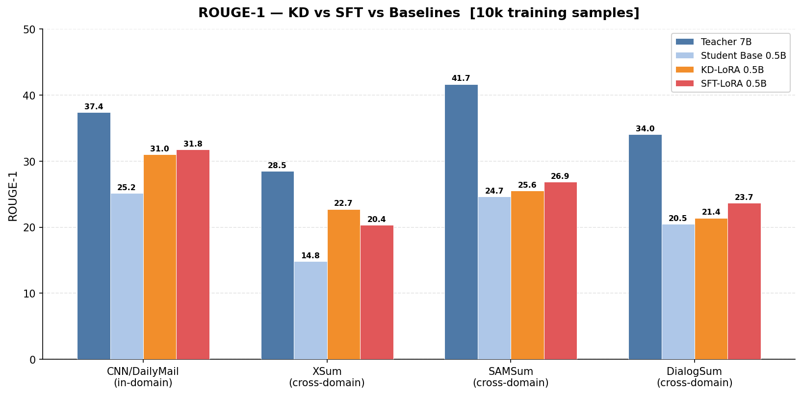
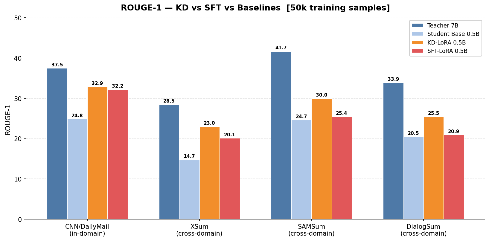
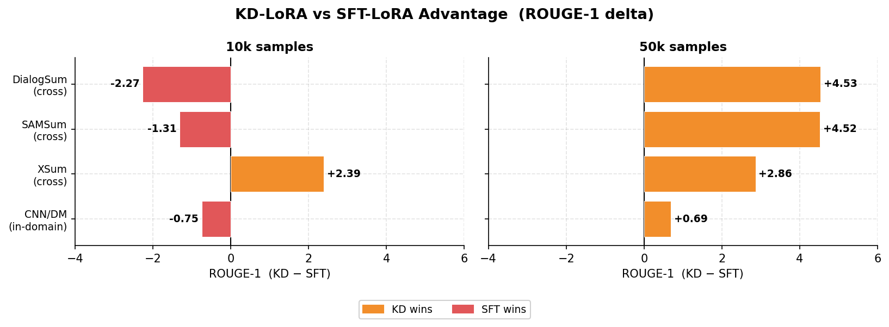
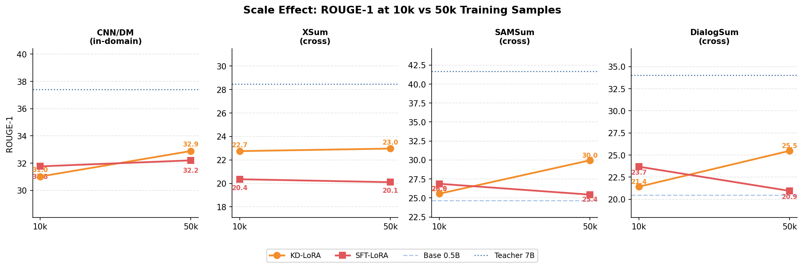
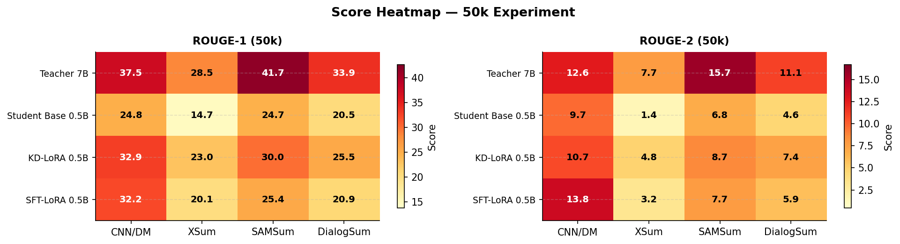

# KD vs SFT with LoRA — Experiment Results

**Setup:** Qwen2.5-7B-Instruct (teacher) → Qwen2.5-0.5B-Instruct (student), CNN/DailyMail summarization  
**Training:** LoRA (r=32, alpha=64), 4 epochs, completion-only loss, left-truncated articles  
**Evaluation:** ROUGE-1/2/L, greedy decoding, 1000 examples (10k run) / 1500 examples (50k run)  
**Datasets:** CNN/DailyMail (in-domain), XSum, SAMSum, DialogSum (all cross-domain)

---

## 1. Headline Numbers

### 10k Training Samples

| Model | CNN/DM | XSum | SAMSum | DialogSum |
|---|---|---|---|---|
| Teacher 7B _(ceiling)_ | 37.4 | 28.5 | 41.7 | 34.0 |
| Student Base 0.5B _(floor)_ | 25.2 | 14.8 | 24.7 | 20.5 |
| **KD-LoRA 0.5B** | 31.0 | **22.7** | 25.6 | 21.4 |
| **SFT-LoRA 0.5B** | **31.8** | 20.4 | **26.9** | **23.7** |

**Winner at 10k: SFT wins 3/4 datasets.** KD only edges SFT on XSum (+2.4).

---

### 50k Training Samples

| Model | CNN/DM | XSum | SAMSum | DialogSum |
|---|---|---|---|---|
| Teacher 7B _(ceiling)_ | 37.5 | 28.5 | 41.7 | 33.9 |
| Student Base 0.5B _(floor)_ | 24.8 | 14.7 | 24.7 | 20.5 |
| **KD-LoRA 0.5B** | **32.9** | **23.0** | **30.0** | **25.5** |
| **SFT-LoRA 0.5B** | 32.2 | 20.1 | 25.4 | 20.9 |

**Winner at 50k: KD wins all 4 datasets.** The margin on cross-domain datasets is striking (+4.5 SAMSum, +4.5 DialogSum).

---

## 2. Plots

### ROUGE-1 by Model — 10k Training Run

### ROUGE-1 by Model — 50k Training Run

### KD vs SFT Advantage (delta per dataset)

The left panel (10k) shows SFT winning 3/4 datasets. The right panel (50k) shows KD winning all four — the reversal is most dramatic on dialogue datasets.

### Scale Effect: 10k → 50k

Both methods improve with more data, but **KD scales faster**. SFT's improvement from 10k to 50k is modest; KD's improvement is large, especially on SAMSum (+4.4) and DialogSum (+4.1).

### Score Heatmap — 50k (ROUGE-1 and ROUGE-2)

---

## 3. Analysis

### Why SFT wins at small data scale (10k)

At 10k samples, both methods have limited training signal. Gold summaries (SFT targets) are clean, concise, and format-consistent — they give the student a straightforward objective. Teacher-generated summaries (KD targets), while richer in semantic structure, are noisier: they sometimes add preambles, vary in length, and don't always match the gold style. With only 10k examples, the student doesn't see enough teacher output variation to learn the underlying pattern — it mostly learns the teacher's surface style quirks.

### Why KD wins at large data scale (50k)

At 50k samples, the student sees enough teacher outputs to learn *what the teacher knows*, not just *how the teacher writes*. The teacher's soft targets encode richer information about token-level distributions over the vocabulary, giving the student a denser gradient signal per example than a hard gold label. This extra signal compounds over 50k examples and pushes the KD student significantly ahead.

### The cross-domain gap is the most telling signal

SFT trains the student to mimic CNN/DailyMail gold-style outputs. The student learns the format of that specific dataset well, but this doesn't generalize. The KD student learns from the teacher's internal representations across all prompt types — representations that are more task-agnostic and transfer better to SAMSum (dialogue) and DialogSum (conversation) even though those domains were never seen in training.

| Effect | 10k (SFT − KD) | 50k (KD − SFT) |
|---|---|---|
| CNN/DM (in-domain) | SFT +0.7 | KD +0.7 |
| XSum (cross-domain) | KD +2.4 | KD +2.9 |
| SAMSum (cross-domain) | SFT +1.3 | KD +4.5 |
| DialogSum (cross-domain) | SFT +2.3 | KD +4.5 |

In-domain the two methods are roughly equivalent at both scales. The real story is cross-domain generalization, and at 50k that advantage belongs clearly to KD.

### Gap to the teacher

Even the best student (KD-LoRA, 50k) sits **4–8 ROUGE-1 points below the teacher** on most datasets, with the largest gap on SAMSum (41.7 vs 30.0). This is expected: the student is 14× smaller and trained on a fraction of the data the teacher was pre-trained on. The teacher remains the ceiling by a comfortable margin.

---

## 4. Key Takeaways

1. **KD needs enough data to pay off.** At 10k, SFT is the safer default. At 50k, KD is clearly the better choice.
2. **Cross-domain generalization is where KD earns its advantage.** In-domain ROUGE is nearly identical at both scales; cross-domain is where the 50k KD student pulls away by 3–5 points.
3. **The scale threshold appears to be somewhere between 10k and 50k.** A follow-up at 25k would pinpoint the crossover.
4. **Both methods comfortably beat the untrained baseline** (+7.8 ROUGE-1 for KD-LoRA 50k on CNN/DM vs the 0.5B base), confirming that LoRA fine-tuning is effective even for a 0.5B model.

---

## 5. Next Steps

- **25k experiment** — find the exact scale crossover between SFT and KD.
- **Soft-label KD** — add KL-divergence loss on token probabilities (in addition to sequence-level MSE) to give the student direct access to the teacher's full distribution.
- **Longer training** — both models were trained for 4 epochs; 6–8 epochs may help KD more than SFT since KD targets are noisier and benefit from more passes.
- **Larger student** — test Qwen2.5-1.5B as the student to see if the KD advantage holds or shrinks with a stronger base.
